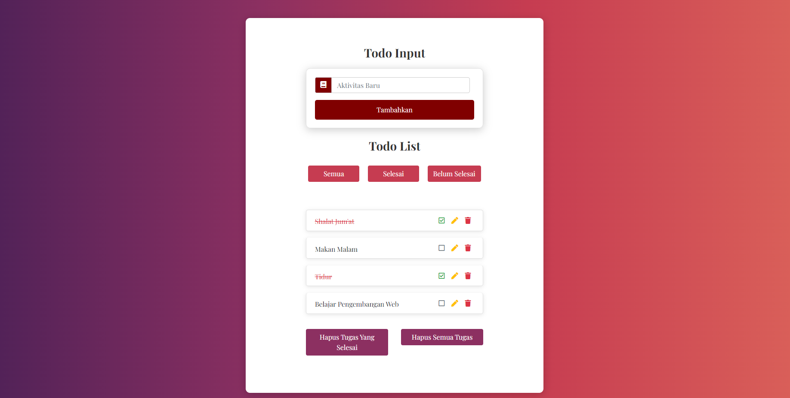

### Tugas Pengembangan Web_Abraham_21060122120030

# Deskripsi
Project ini adalah aplikasi web To-Do List sederhana yang dibangun menggunakan teknologi berikut:
- **React**: Library untuk membangun antarmuka pengguna.
- **uuid**: Library untuk menghasilkan ID unik.
- **JavaScript (ES7+)**: Bahasa pemrograman yang digunakan.
- **Boostrap CSS**: Framework CSS untuk styling.
- **Local Storage**: Penyimpanan data di browser.

# Struktur Proyek
- index.html: File HTML utama yang memuat aplikasi React. Ini juga mengatur favicon dan title halaman, serta menjadi tempat di mana aplikasi React akan dirender.
- TodoInput.js: Komponen yang menyediakan antarmuka untuk memasukkan tugas baru ke dalam daftar To-Do.
- TodoList.js: Komponen yang merender daftar tugas To-Do, menampilkan semua item yang ada dalam daftar.
- TodoItem.js: Komponen yang merender item individu dalam daftar To-Do, termasuk opsi untuk menandai sebagai selesai atau menghapus item.
- App.js: Komponen utama aplikasi yang mengelola state global dan merender komponen TodoInput dan TodoList.
- index.js: Entry point aplikasi yang menggunakan ReactDOM untuk merender komponen App ke dalam elemen DOM dengan ID 'root'.
- index.css: File CSS yang berisi gaya dan aturan styling untuk aplikasi, digunakan untuk mempercantik tampilan antarmuka pengguna.
- package.json: File konfigurasi npm yang mengelola dependensi proyek, skrip, dan metadata lainnya terkait proyek.


# Fungsionalitas Utama
- Menambah To-Do: User dapat menambahkan item baru ke daftar To-Do dengan mengetikkan teks pada "Aktivitas Baru" dan mengklik tombol "Tambahkan".
- Mem-filter To-Do: User dapat melakukan filter untuk melihat semua tugas dengan mengklik tombol "Semua", tugas yang selesai dengan mengklik tombol "Selesai", dan tugas yang belum selesai dengan mengklik tombol "Belum Selesai"
- Menandai Selesai: User dapat menandai item sebagai selesai dengan mengklik checklistbox pada item tersebut. Item yang selesai akan diberi garis tengah berupa coretan dan font akan berwarna merah.
- Mengedit To-Do: User dapat melakukan pengeditan terhadap isi To-Do yang dipilih dengan menekan icon pensil. Setelah ditekan, To-Do tersebut akan masuk kembali ke Todo Input dan user dapat mengedit isinya sebelum ditambahkan kembali ke Todo List
- Menghapus To-Do: User dapat menghapus sebuah item dari daftar dengan mengklik ikon tempat sampah. Selain hal itu, user juga dapat menghapus seluruh tugas yang selesai atau bahkan seluruh tugas yang ada pada Todo List dengan menekan tombol yang sesuai
Penyimpanan Lokal: Daftar To-Do disimpan di local storage sehingga data tetap ada meskipun halaman di-refresh.

# Screenshot


# Langkah Pengoperasian
Memulai proyek
```bash
npm init
npm install
```

Menyesuaikan versi NVM (Kalau bermasalah coba downgrade ke veris-16 menggunakan NVM)
```bash
nvm install 16
nvm use 16
```

Menjalankan proyek (program akan berjalan di http://localhost:3000)
```bash
npm start
```

## Dibuat Dengan

* [ReactJS](https://reactjs.org/)

# Create React App

project ini terinspirasi [Create React App](https://github.com/facebook/create-react-app).


## Pelajari Lebih Lanjut

Pelajari lebih lanjut di[Create React App documentation](https://facebook.github.io/create-react-app/docs/getting-started).

Untuk mempelajari React [React documentation](https://reactjs.org/).